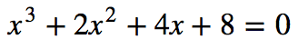
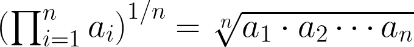
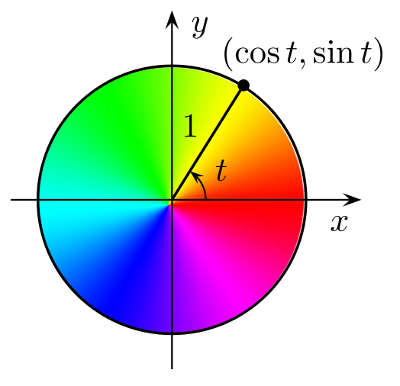

% Scientific Programming <br> with the SciPy Stack
% Shaun Walbridge; Kevin Butler

<section data-background="reveal.js/img/bg-1.png">
<h2>[https://github.com/scw/scipy-devsummit-2018-talk](https://github.com/scw/scipy-devsummit-2018-talk)</h2>
<h3>[High Quality PDF (5MB)](https://4326.us/esri/scipy-2018/devsummit-2018-scipy-arcgis-presentation-full.pdf)</h3>
<h3>[Resources Section](https://4326.us/esri/scipy-2018/#resources)</h3>
</section>

Scientific Computing {data-background="reveal.js/img/bg-2.png"}
====================

Scientific Computing {data-background="reveal.js/img/bg-2.png"}
--------------------

<div style="float: left; width: 50%">
{class="tight"}
</div>
<div style="float: right; width: 45%; text-align: left; padding-top: 20px">
The application of computational methods to all aspects of the process of scientific investigation – data acquisition, data management, analysis, visualization, and sharing of methods and results.
</div>

Extending ArcGIS {data-background="reveal.js/img/bg-2.png"}
----------------

 - ArcGIS is a _system of record_. Combine data and analysis from many fields and into a common environemnt.
 - Why extend? Can't do it all, we support over 1000 GP tools &mdash; enabling _integration_ with other environments to extend the platform.


Python {data-background="reveal.js/img/bg-6.png"}
======

Why Python? {data-background="reveal.js/img/bg-6.png"}
-----------

 - Accessible for new-comers, and the [most taught first language in US universites](http://cacm.acm.org/blogs/blog-cacm/176450-python-is-now-the-most-popular-introductory-teaching-language-at-top-us-universities/fulltext)
 - Extensive package collection (56k on [PyPI](https://pypi.python.org/pypi)), broad user-base
 - Strong glue language used to bind together many environments, both open source and commercial
 - Open source with liberal license &mdash; do what you want

. . . 

<br>

* Resources include materials that for getting started

Python in ArcGIS {data-background="reveal.js/img/bg-6.png"}
----------------

 - Python API for driving ArcGIS Desktop and Server
 - A fully integrated module: ``import arcpy``
 - Interactive Window, Python Addins, Python Tooboxes
 - Extensions:
    + Spatial Analyst: ``arcpy.sa``
    + Network Analyst: ``arcpy.na``
    + Geostatistics: ``arcpy.ga``
    + Fast cursors: ``arcpy.da``
 - ArcGIS API for Python

Python in ArcGIS {data-background="reveal.js/img/bg-6.png"}
----------------

 - Python 3.6 in Pro ([Desktop vs Pro Python](http://pro.arcgis.com/en/pro-app/arcpy/get-started/python-migration-for-arcgis-pro.htm))
    + ``arcpy.mp`` instead of ``arcpy.mapping``
 - Continue to add modules: NetCDF4, xlrd, xlwt, PyPDF2, dateutil, pip, requests, Jupyter &c
 - [Python raster function](http://desktop.arcgis.com/en/desktop/latest/manage-data/raster-and-images/python-raster-function.htm), with a [repository of examples](https://github.com/Esri/raster-functions) using SciPy for on the fly visualizations

<div class="notes">
 - ``arcpy.mp`` Pro works with a conceptual model with _Project_ at the root, so this module reflects that difference from ArcMap where _map document_ is the root with ``arcpy.mapping``.
 - Modules galore: NetCDF4, xlrd, xlwt, PyPDF2, dateutil, pip, ...
</div>

Python in ArcGIS {data-background="reveal.js/img/bg-6.png"}
----------------

 * Here, focus on SciPy stack, what’s included out of the box
 * Move toward maintainable, reusable code and beyond the “one-off”
 * Recurring theme: multi-dimensional data structures

<div class="notes">
Multi-dimensional data structures -- numpy, pandas, our multi-d support all take advantage of different forms of an N-dimensional data structure. Rich, lets you pack simpler data into it for performance, still useful for 1D and 2D data!
</div>

SciPy  {data-background="reveal.js/img/bg-2.png"}
=====

Why SciPy? {data-background="reveal.js/img/bg-2.png"}
----------

* Most languages don’t support things useful for science, e.g.:
    + Vector primitives
    + Complex numbers
    + Statistics
* Object oriented programming isn’t always the right paradigm for 
   analysis applications, but is the only way to go in many modern languages
* SciPy brings the pieces that matter for scientific problems to Python.

SciPy Stack {data-background="reveal.js/img/bg-2.png"}
-----------

{style="width: 600px"}

Included SciPy {data-background="reveal.js/img/bg-2.png"}
--------------

Package                                               KLOC     Contributors      Stars
-------                                             ------   --------------    -------
[IPython](https://ipython.readthedocs.io/en/stable/)    36              532    12519 
[Jupyter Notebooks]()                                   67              323     3766
[matplotlib](http://matplotlib.org/)                   118              693     6867 
[NumPy](http://www.numpy.org/)                         236              429     4011
[Pandas](http://pandas.pydata.org)                     183              408     8765
[SciPy](http://scipy.org/scipylib/)                    387              387     2930
[SymPy](http://sympy.org/)                             243              443     3642

SymPy {data-background="reveal.js/img/bg-2.png"}
-----

{class="tight"} {data-background="reveal.js/img/bg-2.png"}
---------------------------

 - A Computer Algebra System (CAS), solve math equations ([source](../examples/sympy-algebra.py))

```python
from sympy import *
x = symbol('x')
eq = Eq(x**3 + 2*x**2 + 4*x + 8, 0)
```



```python
solve(eq, x)
```


Demo: SymPy {data-background="reveal.js/img/bg-2.png"}
-----------

 {data-background="reveal.js/img/bg-2.png"}
--------------------------------

 - Plotting library and API for NumPy data
 - [Matplotlib Gallery](http://matplotlib.org/gallery.html){target="_newtab"}

 - Also, new in Pro: `arcpy.chart`

ArcGIS + NumPy {data-background="reveal.js/img/bg-2.png"}
==============

 {data-background="reveal.js/img/bg-2.png"}
---------------------------

  1. An array object of arbitrary homogeneous items
  2. Fast mathematical operations over arrays
  3. Random Number Generation


[SciPy Lectures](https://scipy-lectures.github.io/intro/numpy/array_object.html#indexing-and-slicing), CC-BY


 - ArcGIS and NumPy can interoperate on raster, table, and feature data.
 - See [Working with NumPy in ArcGIS](http://desktop.arcgis.com/en/desktop/latest/analyze/python/working-with-numpy-in-arcgis.htm)
 - In-memory data model. Example script to [process by blocks](../examples/process-by-blocks.py) if working with larger data.


ArcGIS + NumPy {data-background="reveal.js/img/bg-2.png"}
--------------


 
 {data-background="reveal.js/img/bg-2.png"}
---------------------------

Computational methods for:

 - Integration ([scipy.integrate](http://docs.scipy.org/doc/scipy/reference/tutorial/integrate.html))
 - Optimization ([scipy.optimize](http://docs.scipy.org/doc/scipy/reference/tutorial/optimize.html))
 - Interpolation ([scipy.interpolate](http://docs.scipy.org/doc/scipy/reference/tutorial/interpolate.html))
 - Fourier Transforms ([scipy.fftpack](http://docs.scipy.org/doc/scipy/reference/tutorial/fftpack.html))
 - Signal Processing ([scipy.signal](http://docs.scipy.org/doc/scipy/reference/tutorial/signal.html))
 - Linear Algebra ([scipy.linalg](http://docs.scipy.org/doc/scipy/reference/tutorial/linalg.html))
 - Spatial ([scipy.spatial](http://docs.scipy.org/doc/scipy/reference/tutorial/spatial.html))
 - **Statistics** ([scipy.stats](http://docs.scipy.org/doc/scipy/reference/tutorial/integrate.html))
 - **Multidimensional image processing** ([scipy.ndimage](http://docs.scipy.org/doc/scipy/reference/tutorial/ndimage.html))

<div class="notes">
Spatial is the tools across all of the domains of science, very general.

That said, can be useful in a variety of circumstances, e.g. `KDTree` for finding data quickly.
</div>

SciPy: Geometric Mean {data-background="reveal.js/img/bg-2.png"}
---------------------

 - Calculating a geometric mean of an _entire raster_ using SciPy ([source](../examples/geometric-mean.py))



```python
import scipy.stats  
rast_in = 'data/input_raster.tif'
rast_as_numpy_array = arcpy.RasterToNumPyArray(rast_in)
raster_geometric_mean = scipy.stats.stats.gmean(
    rast_as_numpy_array, axis=None)  
```

<div class="notes">
([Inspiration](https://geonet.esri.com/message/436296#436296))
</div>

Use Case: Benthic Terrain Modeler {data-background="images/btm-terrain.jpg"}
--------------------------------

Benthic Terrain Modeler {data-background="reveal.js/img/bg-6.png"}
-----------------------

 - A Python Add-in and Python toolbox for geomorphology
 - Open source, can borrow code for your own projects:
   [https://github.com/EsriOceans/btm](https://github.com/EsriOceans/btm)
 - Active community of users, primarily marine scientists, but also useful for other applications 

Lightweight SciPy Integration {data-background="reveal.js/img/bg-6.png"}
-----------------------------

 - Using `scipy.ndimage` to perform basic multiscale analysis
 - Using `scipy.stats` to compute circular statistics
 
Lightweight SciPy Integration {data-background="reveal.js/img/bg-6.png"}
-----------------------------

[Example source](../examples/calculate-bpi-with-scipy.py)
```python
import arcpy
import scipy.ndimage as nd
from matplotlib import pyplot as plt

ras = "data/input_raster.tif"
r = arcpy.RasterToNumPyArray(ras, "", 200, 200, 0)

fig = plt.figure(figsize=(10, 10))
```

Lightweight SciPy Integration {data-background="reveal.js/img/bg-6.png"}
-----------------------------

```python
for i in xrange(25):
    size = (i+1) * 3
    print "running {}".format(size)
    med = nd.median_filter(r, size)

    a = fig.add_subplot(5, 5,i+1)
    plt.imshow(med, interpolation='nearest')
    a.set_title('{}x{}'.format(size, size))
    plt.axis('off')
    plt.subplots_adjust(hspace = 0.1)
    prev = med

plt.savefig("btm-scale-compare.png", bbox_inches='tight')
```

&nbsp; {data-background="images/btm-scale-compare-2.png"}
-

<br>

SciPy Statistics {data-background="reveal.js/img/bg-6.png"}
----------------



 - Break down aspect into `sin()` and `cos()` variables
 - Aspect is a circular variable &mdash; without this 0 and 360 are opposites instead of being the same value

SciPy Statistics {data-background="reveal.js/img/bg-6.png"}
----------------

Summary statistics from SciPy include circular statistics ([source](../examples/circular-stats.py)).

```python
import scipy.stats.morestats

ras = "data/aspect_raster.tif"
r = arcpy.RasterToNumPyArray(ras)

morestats.circmean(r)
morestats.circstd(r)
morestats.circvar(r)
```

Demo: SciPy {data-background="reveal.js/img/bg-2.png"}
-----------

IPython {data-background="reveal.js/img/bg-2.png"}
-------

 - A better `python.exe`
 - Demo: IPython 

Jupyter Notebooks {data-background="reveal.js/img/bg-2.png"}
-----------------

 - A new modality for computing
 - Interactive technical computing, from your browser

Pandas {data-background="reveal.js/img/bg-2.png"}
======

 {data-background="reveal.js/img/bg-2.png"}
----------------------------
 - **Pan**el **Da**ta &mdash; like R "data frames"
 - Bring a robust data _analysis_ workflow to Python
 - Data frames are fundamental &mdash; treat tabular (and multi-dimensional)
   data as a labeled, indexed series of observations.

 {data-background="reveal.js/img/bg-2.png"}
----------------------------

([Source](../examples/pandas-filter.py))
```python
import pandas

data = pandas.read_csv('data/season-ratings.csv')
data.columns
```
```python
Index([u'season', u'households', u'rank', u'tv_households', \
       u'net_indep', u'primetime_pct'], dtype='object')
```

 {data-background="reveal.js/img/bg-2.png"}
----------------------------

```python
majority_simpsons = data[data.primetime_pct > 50]
```
        season households  tv_households  net_indep  primetime_pct
    0        1  13.4m[41]           92.1       51.6      80.751174
    1        2  12.2m[n2]           92.1       50.4      78.504673
    2        3  12.0m[n3]           92.1       48.4      76.582278
    3        4  12.1m[48]           93.1       46.2      72.755906
    4        5  10.5m[n4]           93.1       46.5      72.093023
    5        6   9.0m[50]           95.4       46.1      71.032357
    6        7   8.0m[51]           95.9       46.6      70.713202
    7        8   8.6m[52]           97.0       44.2      67.584098
    8        9   9.1m[53]           98.0       42.3      64.383562
    9       10   7.9m[54]           99.4       39.9      60.916031
    10      11   8.2m[55]          100.8       38.1      57.466063
    11      12  14.7m[56]          102.2       36.8      53.958944
    12      13  12.4m[57]          105.5       35.0      51.094891

Spatial Data Frames {data-background="reveal.js/img/bg-2.png"}
-------------------

 - Same data frame model + geometries
 - ArcPy + ArcGIS API for Python (e.g. Pro 2.1)
 - Continues to expand, check them out

Demo: Pandas {data-background="reveal.js/img/bg-2.png"}
------------


Where and How Fast? {data-background="reveal.js/img/bg-2.png"}
===================

Where Can I Run This? {data-background="reveal.js/img/bg-2.png"}
---------------------
 * Now: 
    - ArcGIS Pro (64-bit) 
    - 10.6: ArcMap, Server, both 32- and 64- bit environments
        + Both now ship with [core Scipy Stack](https://www.scipy.org/about.html)
    - MKL enabled NumPy and SciPy everywhere
    - Conda for managing full Python environments, consuming and producing packages
    - With the ArcGIS API for Python! Can run anywhere Python runs.

<div class="notes">
    - SciPy stack is now available across the platform. Try it out, you can build things that will work on your machine and your users machines without additional work.
</div>

How Does It perform? {data-background="reveal.js/img/bg-2.png"}
--------------------

 * Built with Intel’s [Math Kernel Library (MKL)](https://software.intel.com/en-us/intel-mkl) and compilers&mdash;highly optimized Fortran and C under the hood. 
 * Automated parallelization for executed code

[MKL Performance Chart](https://4326.us/esri/scipy/mkl-perf){target="_newtab"}

<div class="notes">
Quoting Kevin from last year: Wicked fast. Pandas is fast, scipy functions are fast, and we now enable MKL across the platform for all builds. You write Python, but get best of class performance for free.

Take this graph with a large grain of salt. Realistically, can expect 2-10x improvements in many numerical routines.
</div>


from future import * {data-background="reveal.js/img/bg-6.png"}
====================

Opening Doors {data-background="reveal.js/img/bg-6.png"}
-------------

 - Machine learning (``scikit-learn``, ``scikit-image``, ...)
 - Deep learning (``theano``, ...)
 - Bayesian statistics (``PyMC``)
    + Markov Chain Monte Carlo (MCMC)
 - Frequentist statistics (``statsmodels``)
 - With Conda, not just Python! ``tensorflow``, many others

Resources {data-background="reveal.js/img/bg-6.png"}
=========

New to Python {data-background="reveal.js/img/bg-6.png"}
-------------

 - Courses:
    + [Programming for Everybody](https://www.coursera.org/course/pythonlearn)
    + [Codecademy: Python Track](http://www.codecademy.com/tracks/python)
 - Books:
    + [Learn Python the Hard Way](http://learnpythonthehardway.org/)
    + [How to Think Like a Computer Scientist](http://interactivepython.org/runestone/static/thinkcspy/toc.html)

GIS Focused {data-background="reveal.js/img/bg-6.png"}
-----------

 - [Python Scripting for ArcGIS](http://esripress.esri.com/display/index.cfm?fuseaction=display&websiteID=276&moduleID=0)
 - [ArcPy and ArcGIS - Geospatial Analysis with Python](https://www.packtpub.com/application-development/arcpy-and-arcgis-geospatial-analysis-python)
 - [Python Developers GeoNet Community](https://geonet.esri.com/community/developers/gis-developers/python)
 - [GIS Stackexchange](https://gis.stackexchange.com/)

Scientific {data-background="reveal.js/img/bg-6.png"}
----------

 Courses:

 - [Python Scientific Lecture Notes](https://scipy-lectures.github.io)
 - [High Performance Scientific Computing](https://www.coursera.org/course/scicomp)
 - [Coding the Matrix: Linear Algebra through Computer Science Applications](https://www.coursera.org/course/matrix)
 - [The Data Scientist’s Toolbox](https://www.coursera.org/course/datascitoolbox)

Scientific {data-background="reveal.js/img/bg-6.png"}
----------

Books:

 - Free:
    + [Probabilistic Programming & Bayesian Methods for Hackers](https://camdavidsonpilon.github.io/Probabilistic-Programming-and-Bayesian-Methods-for-Hackers/)
        + very compelling book on Bayesian methods in Python, uses SciPy + PyMC.
    + [Kalman and Bayesian Filters in Python](https://github.com/rlabbe/Kalman-and-Bayesian-Filters-in-Python)  

Scientific {data-background="reveal.js/img/bg-6.png"}
----------
 - Paid: 
    + [Coding the Matrix](http://www.codingthematrix.com/)
        + How to use linear algebra and Python to solve amazing problems.
    + [Python for Data Analysis: Data Wrangling with Pandas, NumPy, and IPython](http://shop.oreilly.com/product/0636920023784.do)
        + The cannonical book on Pandas and analysis.

Packages {data-background="reveal.js/img/bg-6.png"}
--------

Only require SciPy Stack:

 - Scikit-learn:
    + [Lecture material](https://scipy-lectures.github.io/advanced/scikit-learn/index.html)
    + Includes SVMs, can use those for image processing among other things...
 - FilterPy, Kalman filtering and optimal estimation:
    + [FilterPy on GitHub](https://github.com/rlabbe/filterpy)
 - [An extensive list of machine learning packages](https://github.com/svaksha/pythonidae/blob/master/AI.md)

Code {data-background="reveal.js/img/bg-6.png"}
----

 - [ArcPy + SciPy on Github](https://github.com/search?p=5&q=scipy+arcpy&type=Code&utf8=%E2%9C%93)
 - [raster-functions](https://github.com/Esri/raster-functions) 
    + An open source collection of function chains to show how to do complex things using NumPy + scipy on the fly for visualization purposes
 - [statistics library](https://docs.python.org/3/library/statistics.html) with a handful of descriptive statistics included in Python 3.4+.
- _TIP_: Want a codebase that runs in Python 2 and 3? [Check out future](http://python-future.org), which helps maintain a single codebase that supports both. Includes the `futurize` script to initially a project written for one version.

Scientific ArcGIS Extensions {data-background="reveal.js/img/bg-6.png"}
----------------------------

 - [PySAL ArcGIS Toolbox](https://github.com/Esri/PySAL-ArcGIS-Toolbox)
 - [Movement Ecology Tools for ArcGIS (ArcMET)](http://www.movementecology.net/)
 - [Marine Geospatial Ecology Tools (MGET)](http://mgel.env.duke.edu/mget/)
    + Combines Python, R, and MATLAB to solve a wide variety of problems
 - [SDMToolbox](http://sdmtoolbox.org/)
    + species distribution & maximum entropy models
 - [Benthic Terrain Modeler](http://www.arcgis.com/home/item.html?id=b0d0be66fd33440d97e8c83d220e7926)
 - [Geospatial Modeling Environment](http://www.spatialecology.com/gme/)
 - [CircuitScape](http://www.circuitscape.org/)

Conferences {data-background="reveal.js/img/bg-6.png"}
-----------

 - [PyCon](http://pycon.org)
    + The largest gathering of Pythonistas in the world
 - [SciPy](https://scipy.org)
    + A meeting of Scientific Python users from all walks
 - [GeoPython](http://www.geopython.net/)
    + The Python event for Python and Geo enthusiasts
 - [PyVideo](http://pyvideo.org/)
    + Talks from Python conferences around the world available freely online.
    + [PyVideo GIS talks](http://pyvideo.org/search?models=videos.video&q=gis)

Closing {data-background="reveal.js/img/bg-2.png"}
=======

Thanks {data-background="reveal.js/img/bg-2.png"}
------

 - Geoprocessing Team
 - ArcGIS API for Python Team
 - The many amazing contributors to the projects demonstrated here.
    + Get involved! All are on GitHub and happily accept contributions.

Rate This Session {data-background="reveal.js/img/bg-2.png"}
-----------------

**iOS, Android**: Feedback from within the app

. . . 

**Windows Phone, or no smartphone?** Cuneiform tablets accepted.

{style="border: none; background: none; box-shadow: none;"}

<span style="display:none">fin</span> {data-background="images/end.png"}
---

